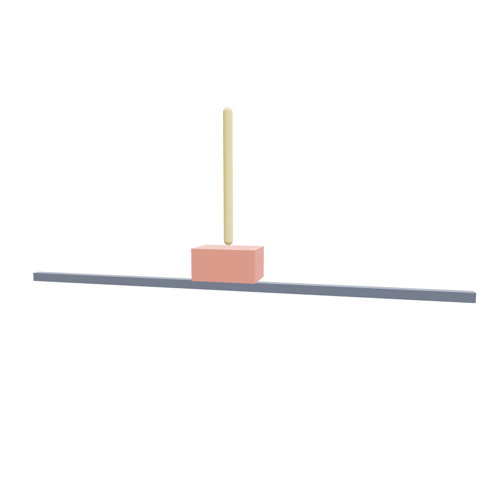
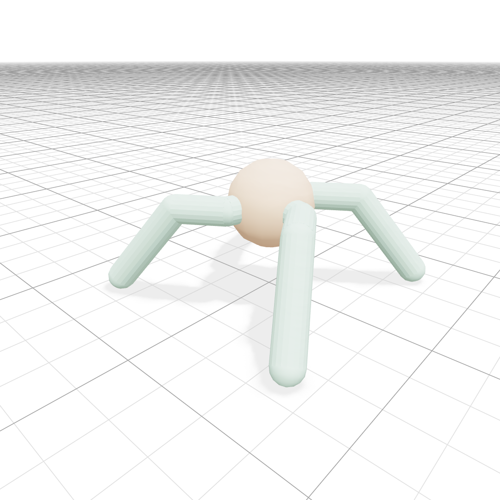
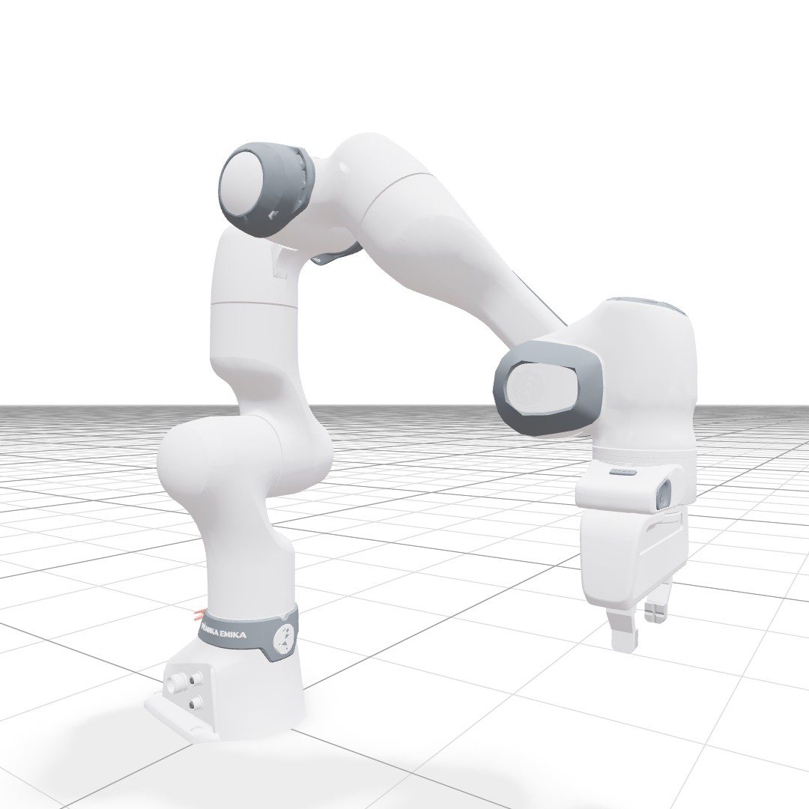
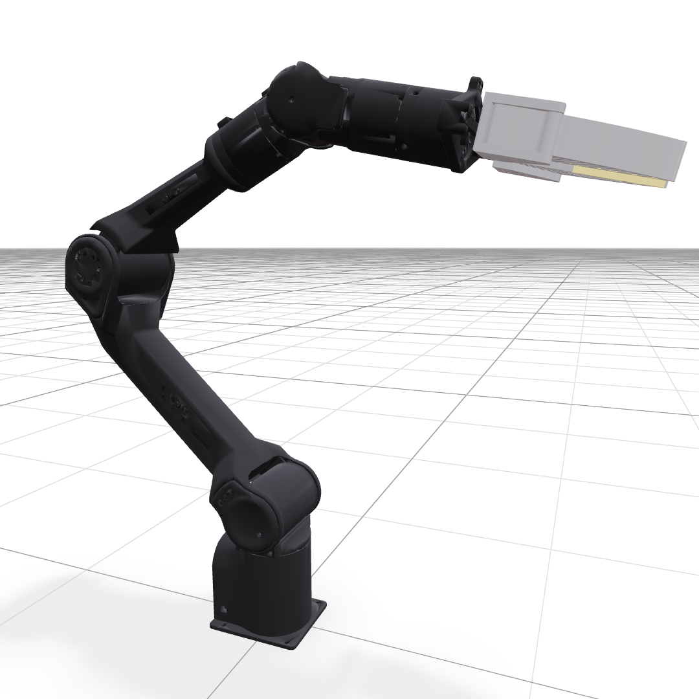
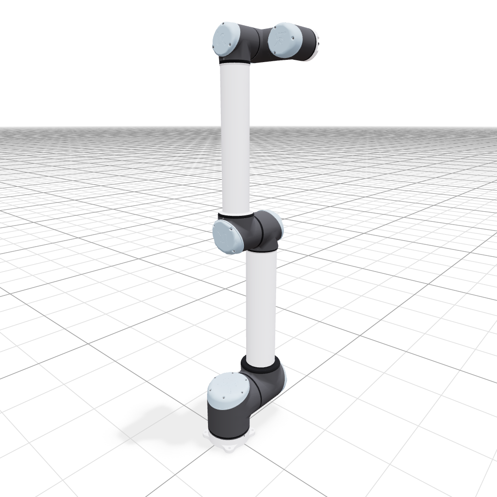
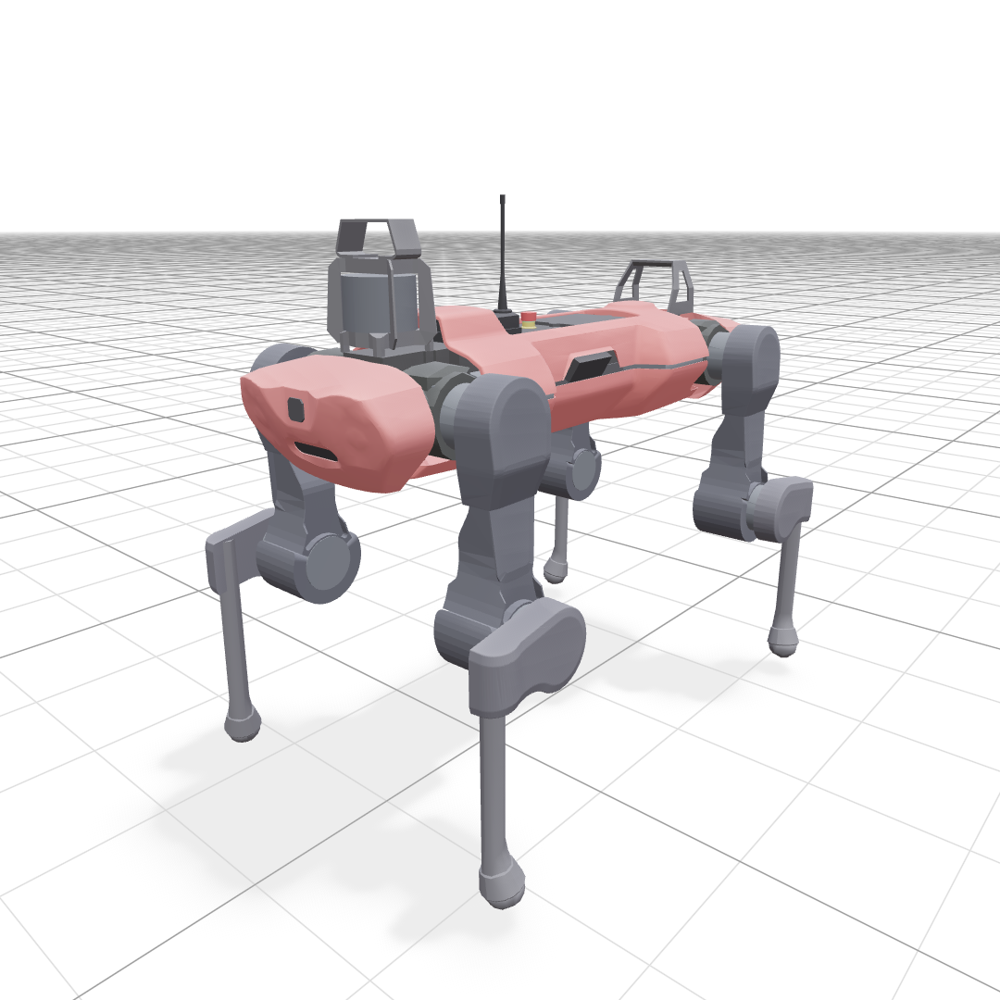
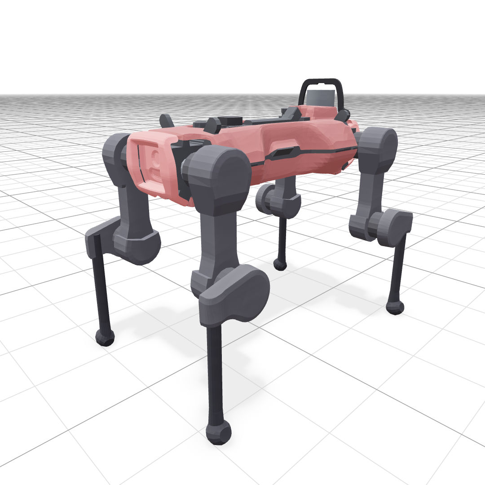
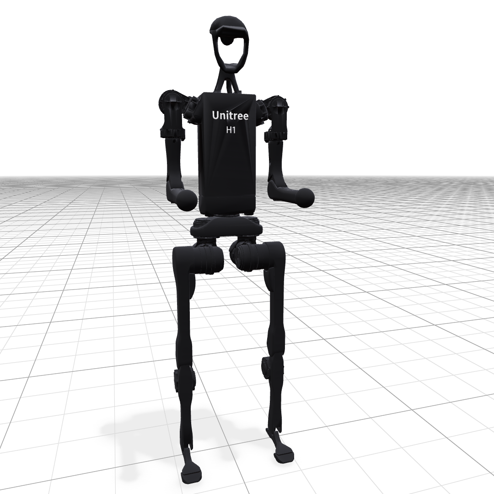
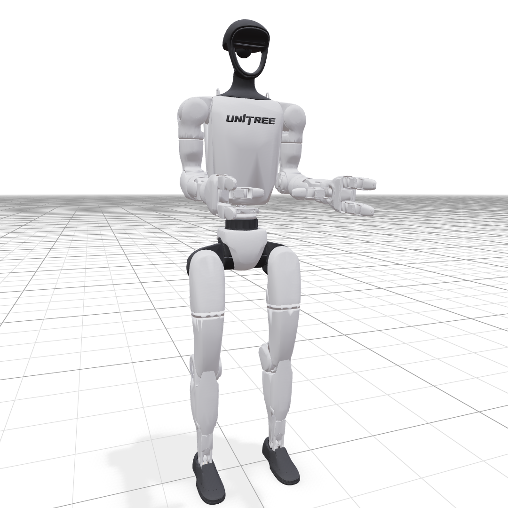

# SAP Warp

SAP Warp is a [Warp](https://nvidia.github.io/warp/stable/)-based
implementation of the SAP contact formulation from
[An Unconstrained Convex Formulation of Compliant Contact](https://arxiv.org/abs/2110.10107)
with additional improvements for robust, stable, and efficient simulation of
frictional contact for robotics. The project follows
[Drake](https://github.com/RobotLocomotion/drake)'s implementation as a
reference and exposes a compact Python/Warp runtime for scene loading, collision
generation, solver benchmarking, and visualization.

This repository is initiated and maintained by the
[AIVC Lab](https://www.math.ucla.edu/aivc/) and
[Toyota Research Institute (TRI)](https://www.tri.global/our-work/robotics).

## Quick Start
SAP Warp is designed for CUDA-accelerated simulation and also supports CPU
execution for lightweight runs.

We recommend using [uv](https://github.com/astral-sh/uv) to set up the
environment. To get started, run:

```shell
uv run python -m viewer.viser.sap_viewer \
  --scene assets/yaml/unitree_g1_usd.yaml
```

The program will launch a [Viser](https://viser.studio/main/) viewer which
defaults to http://localhost:8080.

## Example Scenes

The repository includes several scene files under `assets/yaml/`.

| | | |
| --- | --- | --- |
| [](assets/yaml/basic_cartpole_usd.yaml)<br><sub>Basic cartpole</sub> | [](assets/yaml/basic_ant_usd.yaml)<br><sub>Basic ant</sub> | [](assets/yaml/franka_panda_urdf.yaml)<br><sub>Franka Panda arm</sub> |
| [](assets/yaml/agilex_piper_urdf.yaml)<br><sub>AgileX Piper arm</sub> | [](assets/yaml/universal_ur10_usd.yaml)<br><sub>Universal Robots UR10</sub> | [](assets/yaml/anymal_c_urdf.yaml)<br><sub>ANYmal C quadruped</sub> |
| [](assets/yaml/anymal_d_usd.yaml)<br><sub>ANYmal D quadruped</sub> | [](assets/yaml/unitree_h1_usd.yaml)<br><sub>Unitree H1 humanoid</sub> | [](assets/yaml/unitree_g1_usd.yaml)<br><sub>Unitree G1 humanoid</sub> |

## Documentation
For detailed SAP Warp documentation, see the
[documentation site](https://sap-sim.github.io/sap_warp).

## Integrating Sap Warp in Newton
SAP Warp is fully compatible with
[Newton](https://github.com/newton-physics/newton). See this
[example](sap_with_newton.py) and the documentation for more details.

```shell
uv run --frozen --with 'newton[examples]' python sap_with_newton.py
```

## Contributing

Contributions are welcome. Please keep changes focused, include a small
reproduction or benchmark command when possible, and update documentation for
user-facing behavior.

Current core contributors: [Yunuo Chen](https://github.com/yunuoch),
[Xiang Feng](https://github.com/f1shel), [Chang Yu](https://github.com/g1n0st),
[Yin Yang](https://github.com/yangzzzy),
[Joseph Masterjohn](https://github.com/joemasterjohn), and
[Chenfanfu Jiang](https://github.com/cffjiang).

## License

SAP Warp is released under the Apache 2.0 license. See [LICENSE](LICENSE).

## Citation
If you use SAP Warp in your research, please consider citing:

```
@misc{sapwarp,
  author = {SAP Warp Developers},
  title = {SAP Warp: GPU-accelerated Semi-Analytic Primal Solver for Compliant Frictional Contact},
  month = {June},
  year = {2026},
  url = {https://github.com/sap-sim/sap_warp}
}
```
